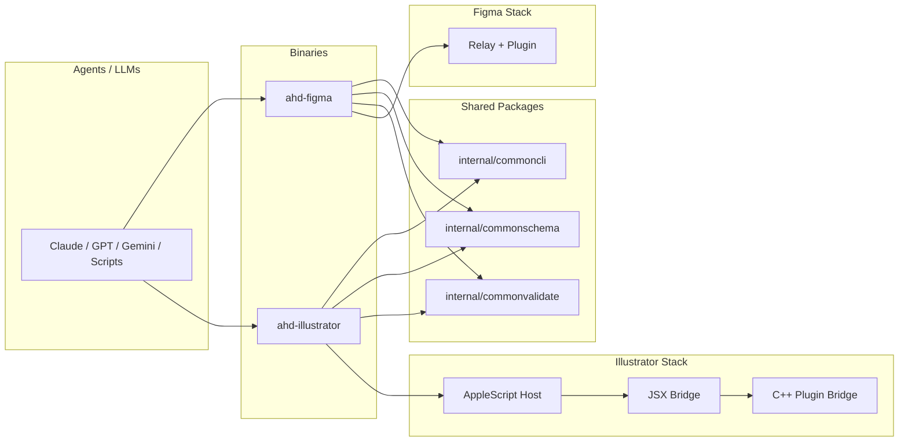

# AI Happy Design

**Give AI agents full design-tool canvas access.**

One Go binary per tool. CLI + WebSocket relay + native plugin. Schema-validated commands, built-in design intelligence, agent-first ergonomics.

[](https://github.com/nerveband/ai-happy-design/releases)
[](https://github.com/nerveband/ai-happy-design/stargazers)
[](https://goreportcard.com/report/github.com/nerveband/ai-happy-design)
[](LICENSE)

**[Documentation](https://aihappydesign.com)** | **[Getting Started](https://aihappydesign.com/getting-started/installation/)** | **[Command Reference](https://aihappydesign.com/reference/commands/)**

Made by [Ashraf Ali](https://ashrafali.net)

---

## What It Does

- **CLI-first design automation** -- 27 ops/sec batch throughput over WebSocket
- **Schema validation with auto-correction** -- fuzzy matching catches LLM hallucinations before they reach the canvas
- **Built-in design intelligence** -- modular type scale, spacing tokens, contrast checks, quality gates
- **Multi-editor MCP support** -- Claude Code, Cursor, Windsurf, VS Code, Zed
- **Two design tools** -- Figma (shipping) and Adobe Illustrator (v0.1, macOS)

## Monorepo Architecture



## Quick Install

### From releases (recommended)

Download the latest binary from the [releases page](https://github.com/nerveband/ai-happy-design/releases).

### From source

```bash
git clone https://github.com/nerveband/ai-happy-design.git
cd ai-happy-design
make build
```

### Upgrade an existing install

```bash
ahd-figma upgrade
```

## Quick Start (Figma)

```bash
# 1. Build the Figma plugin
cd plugin && npm install && npm run build && cd ..

# 2. Load the plugin in Figma
#    Figma > Plugins > Development > Import plugin from manifest
#    Select plugin/manifest.json

# 3. Start the relay
ahd-figma ws

# 4. Register MCP with your editor
ahd-figma register

# 5. Create your first frame
ahd-figma command node.create_frame '{"name":"Hello","width":400,"height":300}'
```

## Quick Start (Illustrator)

```bash
# 1. Build the binary
go build -o bin/ahd-illustrator ./cmd/ahd-illustrator

# 2. Check Illustrator is detected
ahd-illustrator doctor

# 3. Open the host connection
ahd-illustrator host open

# 4. Run a command
ahd-illustrator tools --llm
```

Live validation on March 5, 2026 was run against Adobe Illustrator 30.2.1 on macOS. The host adapter resolves the installed app via bundle id, and the JSX bridge uses an internal ES3-safe serializer because Illustrator's ExtendScript runtime does not expose a global `JSON` object.

## CLI Usage

### Single command

```bash
# Positional JSON argument (preferred)
ahd-figma command text.create '{"content":"Hello World","x":100,"y":200,"fontSize":48}'

# Flag syntax also works
ahd-figma command text.create -p '{"content":"Hello World","x":100,"y":200}'
```

### Batch mode (27 ops/sec)

```bash
# Inline JSON
ahd-figma batch '[
  {"command":"node.create_frame","params":{"name":"card","width":400,"height":300}},
  {"command":"text.create","params":{"parentId":"${{steps.0.result.id}}","content":"Title"}}
]'

# From file
ahd-figma batch ops.json

# From stdin
cat ops.json | ahd-figma batch
```

### Key flags

| Flag | Description |
|------|-------------|
| `--channel` | Target a specific Figma file |
| `--fail-fast` | Stop batch on first error |
| `--compress-images` | Compress images via ImageMagick before sending |
| `--allow-overlap` | Skip auto-placement for batch operations |
| `--lint` | Run design lint on results |
| `--strict-quality` | Fail if design quality score is below threshold |

### Compact aliases

For batch/CLI brevity: `frame`, `rect`, `text`, `fill`, `stroke`, `gradient`, `shadow`, `blur`, `glass`, `noise`, `texture`, `modify`, `mask`, `find`.

Parameter shorthands: `pid`=parentId, `w`=width, `h`=height, `sz`=fontSize, `ff`=fontFamily, `bg`=color, `r`=cornerRadius.

## Schema System

Every command has a typed schema. The validator catches mistakes before they reach the canvas.

```bash
# List all commands
ahd-figma schema

# Get schema for a specific command
ahd-figma schema text.create --json

# Dry-run validation (no canvas changes)
ahd-figma validate -f ops.json
```

**Auto-correction features:**
- Fuzzy matching: `creat_frame` -> `node.create_frame`
- Named colors: `"red"` -> `"#FF0000"`
- Alias resolution: `fillColor` -> `color`, `size` -> `fontSize`
- Type coercion: `"48"` -> `48` for numeric fields

## Design Intelligence

Built-in design knowledge that LLMs can query at runtime.

```bash
# Compute design tokens for any canvas size
ahd-figma command design.compute_tokens '{"width":1080,"height":1920}'

# Get design methodology
ahd-figma guide

# Deep-dive into a topic
ahd-figma guide --topic typography
ahd-figma guide --topic color
ahd-figma guide --topic layout
```

**Design tokens** auto-scale to canvas size using a perfect-fourth (1.333) type scale:
caption -> body -> subheading -> heading -> title -> hero -> display

**Quality gates** check contrast ratios, text sizing, spacing consistency, grid alignment, and visual hierarchy.

## Figma Architecture

```
Agent/LLM
    |
    v
ahd-figma CLI  --->  WebSocket Relay (port 3055)  --->  Figma Plugin
    |                                                        |
    v                                                        v
  Schema                                               Figma Canvas
  Validation                                           (create, modify,
  + Design Lint                                         export nodes)
```

The CLI sends JSON commands over WebSocket to the relay, which forwards them to the Figma plugin running inside the Figma desktop app. The plugin executes commands against the Figma Plugin API and returns results back through the same channel.

## Illustrator Architecture

The Illustrator CLI uses a three-layer bridge: Go CLI -> AppleScript host -> JSX bridge -> Illustrator scripting engine. The current script-backed surface covers 30+ command namespaces including `document.*`, `artboard.*`, `layer.*`, `text.*`, `path.*`, `export.*`, `inspect.*`, and more. No plugin or SDK installation is required for the current CLI surface.

See [docs/illustrator/architecture.md](docs/illustrator/architecture.md) for the full technical overview.

## Agent-First Principles

- Typed schema contracts are the source of truth, not prose docs
- JSON envelopes are the default public contract
- `tools` and `schema` are canonical discovery surfaces
- `--dry-run` is required on all mutating Illustrator command flows
- `--fields` and NDJSON output keep agent context under control
- Validation and hardening happen before execution, not after failure
- Opaque identifiers reject URL, query, fragment, and encoded traversal syntax
- Cross-field validation blocks impossible payloads before they reach the canvas

## Use Cases

- **Social media graphics** -- Generate Instagram posts, stories, carousels at scale
- **Presentation slides** -- Build pitch decks and slide sets programmatically
- **Design systems** -- Audit and generate component libraries
- **Marketing assets** -- Batch-produce ads, banners, email headers
- **Prototyping** -- Rapid UI mockups from natural language descriptions
- **Design QA** -- Automated contrast, spacing, and hierarchy checks

## Repo Layout

```text
cmd/ahd-figma/            Figma CLI binary
cmd/ahd-illustrator/      Illustrator CLI binary
internal/commoncli/       Shared envelopes, output, and command helpers
internal/commonschema/    Shared schema registry and types
internal/commonvalidate/  Shared validation and hardening
internal/schema/          Figma command schemas
internal/tools/           MCP tools, design catalog, design tokens
internal/ws/              WebSocket relay server and client
internal/illustrator/     Illustrator host, bridge, commands, schemas
plugin/                   Figma plugin (TypeScript, esbuild)
tools/illustrator/        JSX and C++ plugin bridge assets
docs/                     Architecture docs, examples, research
skills/                   Agent skill bundles (SKILL.md files)
prompts/                  Release checklists, agent-dx baselines
```

## Documentation

Full docs at **[aihappydesign.com](https://aihappydesign.com)**

- [Installation](https://aihappydesign.com/getting-started/installation/)
- [Quick Start](https://aihappydesign.com/getting-started/quickstart/)
- [CLI Usage](https://aihappydesign.com/guides/cli-usage/)
- [Batch Operations](https://aihappydesign.com/guides/batch-operations/)
- [Design Intelligence](https://aihappydesign.com/guides/design-intelligence/)
- [Command Reference](https://aihappydesign.com/reference/commands/)
- [Schema System](https://aihappydesign.com/reference/schema/)
- [Architecture](https://aihappydesign.com/architecture/overview/)
- [Illustrator Overview](docs/illustrator/README.md)
- [Illustrator Commands](docs/illustrator/commands.md)

## Skills

Agent skill bundles for LLM integration:

- [AHD Figma Skill](skills/ai-happy-design/SKILL.md)
- [AHD Illustrator Skill](skills/ahd-illustrator/SKILL.md)

## Contributing

### Build from source

```bash
git clone https://github.com/nerveband/ai-happy-design.git
cd ai-happy-design

# Build everything
make build

# Or build individually
make build-figma
make build-illustrator
```

### Run tests

```bash
# Go tests
go test ./...

# Plugin typecheck + build + syntax verification
cd plugin && npm run check

# Full deploy (build + sign + install + restart relay)
make deploy
```

### Plugin development

The Figma plugin targets ES6 (QuickJS/WASM sandbox). Do not use optional chaining (`?.`), nullish coalescing (`??`), or object spread (`{...obj}`). See [AGENTS.md](AGENTS.md) for the full list of constraints.

```bash
cd plugin
npm install
npm run build

# Verify no unsupported syntax
grep -c '\?\.' dist/code.js    # must be 0
grep -c '\?\?' dist/code.js    # must be 0
```

### Release process

See [prompts/release-flow.md](prompts/release-flow.md) and [prompts/pre-release-check.md](prompts/pre-release-check.md).

## Status

- **ahd-figma**: Active and shipping. 130+ commands, schema validation, design intelligence, MCP support.
- **ahd-illustrator**: v0.1, macOS-only, CLI-only. Live-validated script mode covering 30+ command namespaces. The native plugin is optional and diagnostic-only.

## Trademark Disclaimer

Adobe Illustrator is a trademark of Adobe. Figma is a trademark of Figma, Inc. This project is unaffiliated with either company.

## License

[GPL-3.0](LICENSE) — Free software. Fork it, ship it, improve it.

Made by [Ashraf Ali](https://ashrafali.net)
