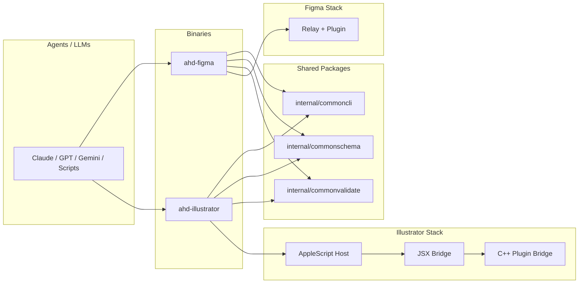

# AHD Design Monorepo

`ai-happy-design` now serves as the monorepo root for AHD design automation tools:

- `ahd-figma`: the existing Figma CLI and relay workflow, now under the `ahd-*` naming scheme
- `ahd-illustrator`: a new macOS-first Illustrator CLI with an agent-first JSON contract

The GitHub repository name stays `ai-happy-design` for now. The shipped binaries do not.

Made by [Ashraf Ali](https://ashrafali.net) | [GitHub](https://github.com/nerveband/ai-happy-design) | MIT License

## Monorepo Architecture



## Quickstart

### `ahd-figma`

```bash
make build-plugin sync-plugin
go build -o bin/ahd-figma ./cmd/ahd-figma
./bin/ahd-figma setup
./bin/ahd-figma relay start
./bin/ahd-figma tools --llm --json
```

### `ahd-illustrator`

```bash
go build -o bin/ahd-illustrator ./cmd/ahd-illustrator
./bin/ahd-illustrator doctor
./bin/ahd-illustrator host open
./bin/ahd-illustrator tools --llm
```

## Agent-First Principles

- JSON envelopes are the default public contract.
- `tools` and `schema` are canonical discovery surfaces.
- `--dry-run` is required on all mutating Illustrator command flows.
- `--fields` and NDJSON output keep agent context under control.
- Validation and hardening happen before execution, not after failure.

## Repo Layout

```text
cmd/ahd-figma/            Existing Figma CLI under the new binary name
cmd/ahd-illustrator/      Illustrator CLI
internal/commoncli/       Shared envelopes, output, and command helpers
internal/commonschema/    Shared schema registry/types
internal/commonvalidate/  Shared validation and hardening
internal/illustrator/     Illustrator host, bridge, commands, inspect, schema
plugin/                   Figma plugin
tools/illustrator/        JSX and C++ plugin bridge assets
docs/illustrator/         Illustrator architecture and operator docs
skills/ahd-illustrator/   Agent skill bundle
```

## Status

- `ahd-figma`: active and shipping from this repo
- `ahd-illustrator`: v0.1 scope is macOS-only, CLI-only, with script fallback plus plugin capability mode

## Docs

- [Docs index](docs/README.md)
- [Illustrator overview](docs/illustrator/README.md)
- [Illustrator architecture](docs/illustrator/architecture.md)
- [Illustrator commands](docs/illustrator/commands.md)
- [Illustrator plugin build](docs/illustrator/plugin-build.md)
- [Illustrator release notes](docs/illustrator/release-notes-v0.1.md)
- [Implementation plan](docs/plans/2026-03-05-ahd-illustrator-monorepo-spec.md)

## Skills

- [AHD Illustrator skill](skills/ahd-illustrator/SKILL.md)

## Trademark Disclaimer

Adobe Illustrator is a trademark of Adobe. This project is unaffiliated.
